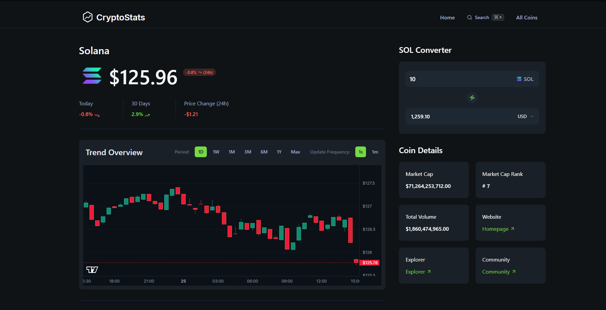

# Cryptostats - Advanced Crypto Screener

Cryptostats is a modern, high-performance web application for tracking, analyzing, and screening cryptocurrencies. It provides real-time data, detailed analytics, and a fast, intuitive user interface, leveraging the CoinGecko API.

## Features

### 1. Comprehensive Cryptocurrency Discovery

- **Homepage Dashboard**: Get a quick overview of the market with lists of **Trending Coins** and top **Categories**.
- **All Coins Page**: A paginated and sortable data table of all available cryptocurrencies. View essential metrics at a glance, including price, 24h price change, and market cap.

### 2. In-Depth Coin Analysis

- **Detailed Coin Pages**: Each cryptocurrency has a dedicated page with a wealth of information.
- **Real-Time Data**: The coin detail page features a **live-updating price** and a real-time candlestick chart powered by WebSockets.
- **Interactive Candlestick Charts**: Visualize price movements (OHLC) across different time frames.
- **Currency Converter**: A handy tool to calculate the value of a coin against various fiat currencies (USD, EUR, etc.).
- **Essential Information**: Quick access to market cap, market rank, trading volume, and direct links to the coin's official website, blockchain explorer, and community pages.



### 3. Blazing-Fast Search

- **`Cmd+K` Quick Search**: Open a search modal from anywhere in the app with the `Cmd+K` (or `Ctrl+K`) keyboard shortcut.
- **Instantaneous Results**: As you type, the app efficiently searches for coins by name or symbol, with debouncing to prevent excessive API calls.
- **Trending Suggestions**: The search modal shows a list of currently trending coins for quick discovery.


### 4. Modern, Performant Tech Stack

- **Next.js App Router**: Built with the latest Next.js features for optimal performance, server-side rendering, and a great developer experience.
- **React & SWR**: A dynamic and responsive UI built with React, with efficient client-side data fetching and caching via SWR.
- **Tailwind CSS**: A utility-first CSS framework for rapid and consistent styling.
- **CoinGecko API**: All cryptocurrency data is sourced from the reliable and comprehensive CoinGecko API.

---

## Getting Started

Follow these instructions to get the project up and running on your local machine.

### Prerequisites

- [Node.js](https://nodejs.org/) (version 20 or later recommended)
- `npm`, `yarn`, or `pnpm`

### Installation & Setup

1.  **Clone the repository:**

    ```bash
    git clone <repository-url>
    cd cryptostats
    ```

2.  **Install dependencies:**

    ```bash
    npm install
    ```

3.  **Set up environment variables:**
    The project requires API keys for the CoinGecko API.
    - Copy the example environment file:
      ```bash
      cp .env.example .env.local
      ```
    - Get a free or paid API Key from [CoinGecko](https://www.coingecko.com/en/api).
    - Open `.env.local` and add your API key. For development, you can use the Demo API.

      ```env
      # For Development (uses CoinGecko Demo API)
      COINGECKO_DEV_BASE_URL=https://api.coingecko.com/api/v3
      COINGECKO_DEV_API_KEY=YOUR_COINGECKO_DEMO_API_KEY

      # For Production (uses CoinGecko Pro API)
      COINGECKO_PROD_BASE_URL=https://pro-api.coingecko.com/api/v3
      COINGECKO_PROD_API_KEY=YOUR_COINGECKO_PRO_API_KEY
      ```

    **⚠️ WARNING:** This project's client-side code exposes a CoinGecko API key. This setup is intended for demonstration purposes only with a non-privileged, demo API key. For a production environment, it is highly recommended to implement a backend proxy that securely manages the WebSocket connection and API key. Your client application would then connect to your secure backend instead of directly to CoinGecko.

### Running the Application

1.  **Start the development server:**

    ```bash
    npm run dev
    ```

2.  **Open the application:**
    Open your browser and navigate to [http://localhost:3000](http://localhost:3000).

### Real-Time Data in Development

The application includes a special mode for handling real-time data during development. This is activated by setting `NEXT_PUBLIC_API_MODE=DEV` in your `.env.local` file (in addition to `API_MODE=DEV` for server-side behavior).

- **Production Mode (Default):** The app uses a **WebSocket** connection to receive a real-time data stream from the CoinGecko API for instant price and trade updates.
- **Development Mode:** To conserve API resources, this mode **simulates** live updates without a persistent WebSocket connection. Instead, it uses **HTTP Polling** to fetch the latest data from the REST API every 5 seconds.

---

## Available Scripts

- `npm run dev`: Starts the development server.
- `npm run build`: Creates a production-ready build of the application.
- `npm run start`: Starts the production server (requires a build to be created first).
- `npm run lint`: Lints the codebase to check for errors and style issues.

---

## Credits

This project was built with the help of the following resources:

- **Tutorial:** [JavaScript Mastery - Build an Advanced Crypto Screener App](https://www.youtube.com/watch?v=-vsh_GxC-vg)
- **API Documentation:** [CoinGecko API Docs](https://docs.coingecko.com)
